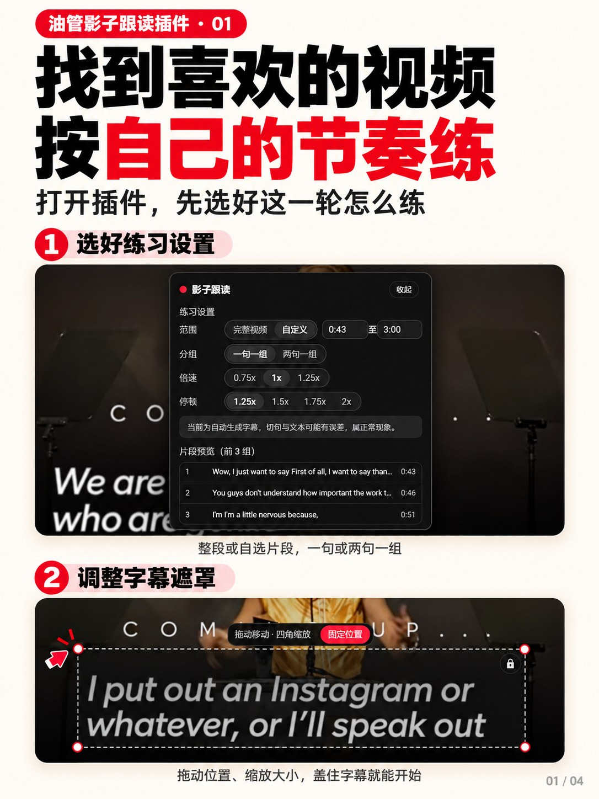

# YouTube 影子跟读训练器 (YouTube Shadowing Trainer)

<p align="center">
  <a href="LICENSE"></a>
  
  
  
</p>

> 把你正在看的 YouTube 英文视频，一键变成自动化的影子跟读练习。
> One click to turn any YouTube video with English captions into a structured shadowing practice.

一个桌面端 Chrome 扩展（Manifest V3）：自动读取视频英文字幕并切句，逐句完成「盲听 → 盲听跟读 → 字幕复听 → 字幕跟读」四阶段训练，再进行整段完整跟读，最后生成语音反馈与表达积累。所有练习数据只存在你的浏览器里——无需注册，无需任何 Key 即可完整使用。

## 快速开始

1. **下载**：到 [Releases](../../releases) 下载最新版 zip（或本页右上角 `Code → Download ZIP`）
2. **加载**：解压后打开 `chrome://extensions`，右上角打开「开发者模式」→ 点「加载已解压的扩展程序」→ 选中解压出的文件夹
3. **开练**：打开任意带英文 CC 字幕的 YouTube 视频，点浏览器工具栏上的插件图标

要求桌面端 Chrome 111+，仅支持 `youtube.com/watch` 视频页。

## 界面预览

|  |  |
|:---:|:---:|
| **① 练习设置与遮罩调整** | **② 盲听 → 盲听跟读** |
|  |  |
| **③ 字幕复听 → 字幕跟读** | **④ 完整跟读 → 练习结果** |

## 欢迎魔改

这个项目刻意写得小而直白：没有构建步骤、没有框架依赖，每个环节的「改口」都集中在一处——切句粒度在 `lib/segments.js`，表达卡 Prompt 在 `lib/ai.js`，搭配与句式语料在 `lib/expressions.js`，视觉在 `lib/styles.js` 顶部的几个变量，快捷键在 `lib/state-machine.js`。**按你自己的学习习惯 vibe coding 出你的版本**：直接 Fork 改起来，改得好欢迎提 PR 回来——各文件的具体职责见下方「项目结构」与「本地开发」。

## 它解决什么问题

影子跟读的训练价值依赖高频重复，但手工练习的成本极高：暂停、回拖进度条、切字幕、控制停顿——准备时间比练习时间还长。本扩展把这一切自动化：

- **自动切句**：读取视频英文字幕（含自动字幕的词级时间戳），按标点、语音停顿和连接词边界重组为适合跟读的意群；
- **全自动状态机**：每组自动完成「盲听 → 盲听跟读 → 字幕复听 → 字幕跟读」，无需任何点击；
- **完整跟读**：整段连续播放 + 录音，可选实时跟随文本；
- **练后反馈**：漏读错读（词级对齐）、语速 WPM 对比、停顿分析、优先重练片段；
- **表达积累**：从原字幕提取固定搭配、句式结构、值得记的词，可收藏、可跳回原声。

## 功能一览

- 🎯 **逐句训练状态机**：全自动推进，空格/Enter 可随时跳过，控制条支持上一组/重来/下一组/暂停/退出
- 🖼 **视频内浮动遮罩**：可拖动、四角缩放、一键锁定；普通/剧场/全屏模式自动跟随，位置按视频记忆
- 🎙 **完整跟读**：麦克风录音 + 录音计时 + 实时跟随文本（可关闭）
- 📊 **基础语音反馈**：转写与字幕对齐，输出完成度、漏读错读（低置信措辞）、语速对比、停顿统计
- 🧠 **表达积累**：LLM 生成（可接任意 OpenAI 兼容接口）或本地规则引擎兜底，支持收藏
- 🛡 **异常处理**：广告自动暂停恢复、缓冲冻结倒计时、切视频自动清理、断点续练
- 🔒 **隐私优先**：全部数据本地存储；录音仅在完整跟读时进行，默认不落盘；不收集任何账号信息

## 使用

1. **点击扩展图标** → 自动完成「检测视频与字幕 → 读取英文字幕 → 切分训练片段」
2. **练习设置**：练习范围（完整/自定义起止）、一句或两句一组、播放倍速（0.75–1.25x）、停顿倍率（1.25–2x）；面板实时显示前 3 组预览与预计总时长
3. **调整遮罩**：拖动/缩放遮罩盖住视频自带字幕区域，点「固定位置并开始」
4. **逐句训练**：四阶段自动循环；**Enter**＝跳过当前阶段（播放→跟读、跟读→下一组）；控制条可暂停/重来/跳组
5. **完整跟读**：授权麦克风后连续播放并录音，实时跟随文本可开关
6. **练习结果**：完成度、优先重练（点击跳原声）、语速对比、表达积累（可收藏、跳原句）

### 快捷键

| 按键 | 行为 |
|---|---|
| `Enter` | 推进：跳过当前播放 / 进入下一组 / 完整跟读中暂停-继续 |
| `空格` | 完整跟读中＝暂停/继续录音；其余场景保留 YouTube 原生行为 |

## AI 设置（可选）

启动面板右下角「AI 设置」进入配置页。**不配置也能完整使用**（语音反馈走 Chrome 内置识别，表达卡走本地规则引擎）。

- **表达卡 LLM**：支持任意 OpenAI 兼容接口（OpenAI / 智谱 GLM / DeepSeek / 硅基流动 / Groq / 自定义），内置服务商预设；生成优先固定搭配与习语，单词卡仅来自你的漏读词
- **云端语音识别**（可选）：切换到「云端接口」后录音将发送到你配置的 `/audio/transcriptions` 接口（如 whisper-1 / whisper-large-v3 / SenseVoice）
- 保存时会请求一次对应域名的访问权限；API Key 只存本地 `chrome.storage.local`
- 每项都有「测试连接」按钮验证连通性

## 隐私

- 练习设置、遮罩位置、收藏表达、练习记录、本地埋点：**仅存本地**，不向任何服务器上传
- **API Key 只存本地**；录音与字幕文本仅发往**你自己配置的接口**
- 录音仅在完整跟读阶段进行（点击开始时才申请麦克风权限），反馈生成后不落盘
- 不收集 YouTube 登录凭据，不绕过地区、年龄、会员或版权限制

## 项目结构

```
├── manifest.json          # MV3 清单（内容脚本双世界注入）
├── background.js          # Service Worker：图标点击、脚本注入、云端 ASR/LLM 代理
├── main-world.js          # 页面主世界：播放器数据、字幕请求拦截、播放控制桥
├── content.js             # 编排：启动检测、设置、会话生命周期、快捷键
├── options.html / .js     # AI 服务设置页（服务商预设、Key、连通性测试）
├── icons/                 # 扩展图标
└── lib/
    ├── store.js           # 本地存储（设置/遮罩位置/收藏/记录/埋点）
    ├── bridge.js          # 内容脚本 ↔ 页面主世界消息桥
    ├── captions.js        # 字幕适配器（多格式拉取 + 词级时间戳解析）
    ├── segments.js        # 切句与分组（标点/停顿/连接词启发式 + 碎片合并）
    ├── clock.js           # 可冻结倒计时（缓冲/广告/标签页休眠感知）
    ├── state-machine.js   # 逐句训练状态机 + 完整跟读
    ├── recorder.js        # 麦克风录音与音频能量分析
    ├── feedback.js        # 转写-字幕对齐（漏读/语速/停顿）+ Chrome 内置识别
    ├── ai.js              # 云端 ASR / LLM 表达卡客户端（含 Prompt）
    ├── expressions.js     # 表达规则引擎（兜底）+ 句式/搭配语料
    ├── styles.js          # 浮层样式（Shadow DOM，不污染宿主页面）
    └── ui.js              # 全部页面内 UI（启动面板/遮罩/控制条/结果页）
```

## 本地开发

- 无需构建工具：改完代码后在 `chrome://extensions` 点击刷新即可生效
- 语法检查：`node --check <file>`；打包发布：将目录压缩为 zip
- 想调切句粒度：`lib/segments.js` 的 `buildSentences()`（停顿阈值、连接词表、碎片合并）
- 想调表达卡筛选：`lib/ai.js` 的 `generateExpressions()`（Prompt）与 `lib/expressions.js`（语料库）
- 想改视觉：`lib/styles.js` 顶部 CSS 变量

欢迎 PR：字幕适配器的健壮性、更多语言的切句规则、更细的反馈维度都是好方向。

## 已知限制

- YouTube 字幕接口属于非公开数据，页面改版可能导致读取失效（已做适配层隔离，失败时有明确提示与重试）
- 自动字幕（ASR）没有标点，切句基于词级时间戳与停顿启发式，个别分句与语法句会有出入
- Chrome 内置语音识别精度有限，所有漏读/错读反馈均使用「可能」措辞并支持复听核实

## 免责声明

本项目与 YouTube、Google 无关，仅用于语言学习。扩展只读取播放器自身使用的字幕数据，不绕过任何登录、地区、年龄、会员或版权限制；请遵守 YouTube 服务条款，仅将字幕用于个人学习。

## License

[MIT](LICENSE)
